# Clínica_Capivárias

Sistema da clínica veterinária Capivárias. 

Trabalho solicitado no SENAI nas disciplinas de Programação Front-End, Programação Back-End e Banco de Dados.  
Case realizado pela Squad AFSS visando uma experiência real do mercado de trabalho na área de desenvolvimento de sistemas.

# :hammer: Funcionalidades do projeto
- ` Agendamento`: definição de data e horário do atendimento ao pet.
- ` Perfil usuário`: login e logout do tutor do Pet.
- ` Perfil administrador`: Acesso a funcionabilidades do administrador.

# :pencil2: Imagens da Aplicação
Homepage:  
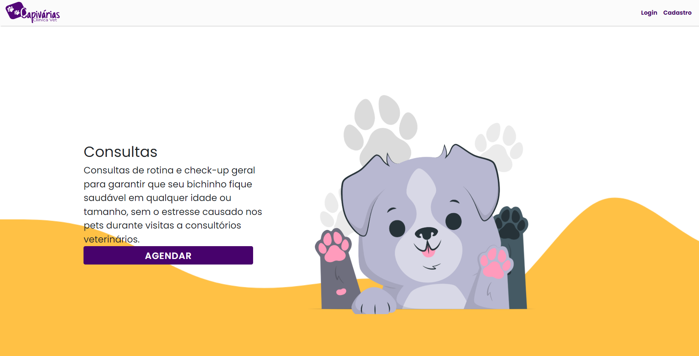

Login:  
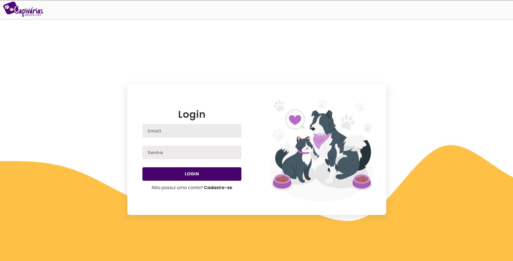

Cadastro de Usuário:  
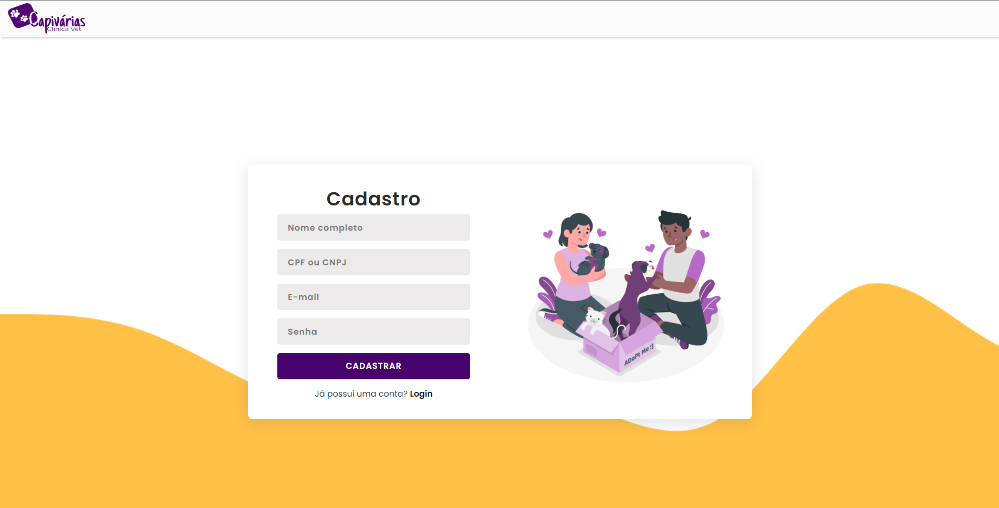

Edição do Cadastro de Usuário:  
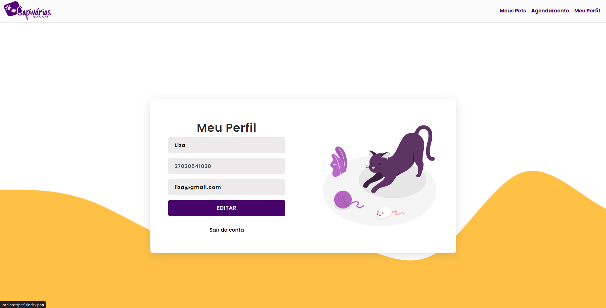

Lista de Usuários:  
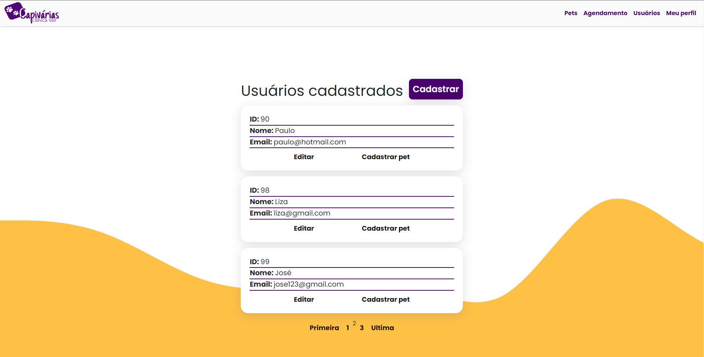

Cadastro PET:  
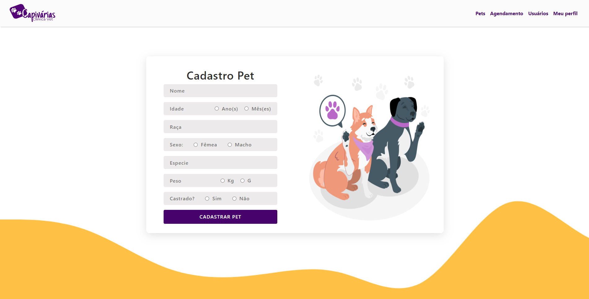

Edição do Cadastro PET:  
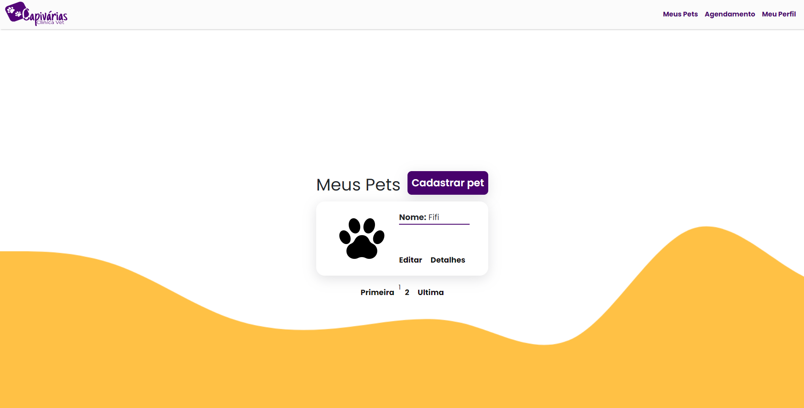

Ficha do PET:  
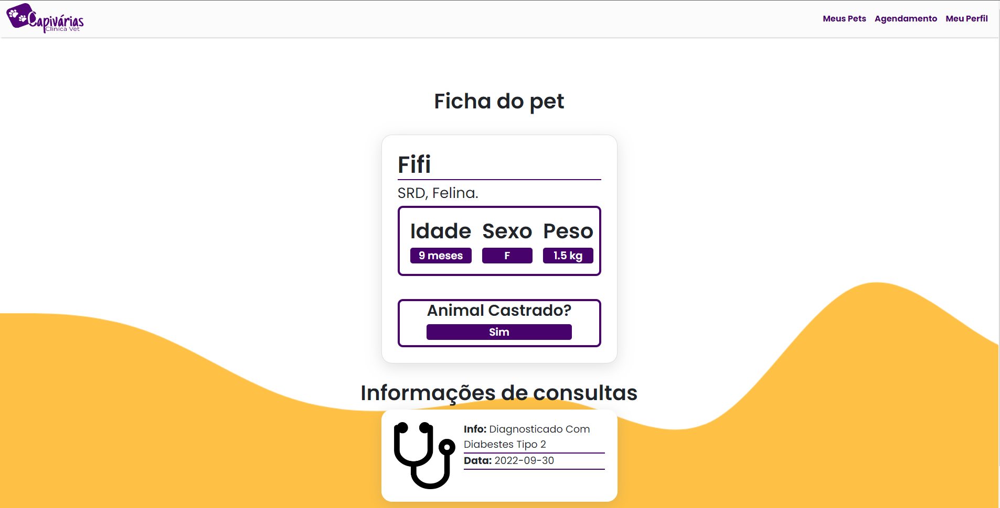

Consultas Marcadas dos PET:  
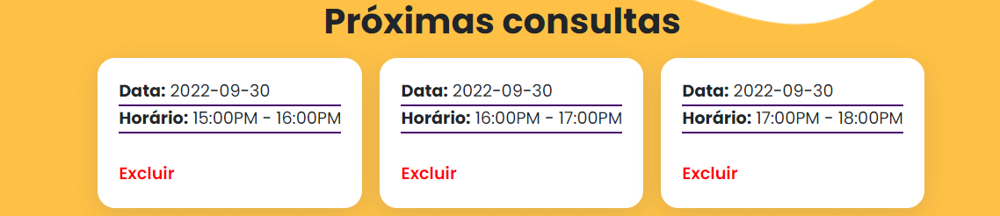

Agenda:  
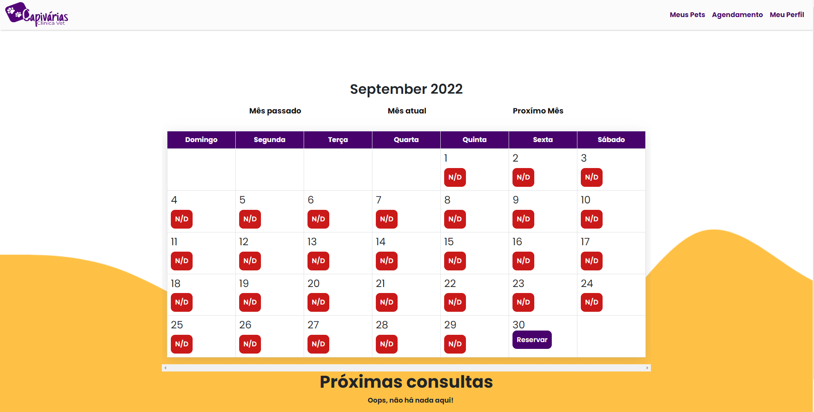 
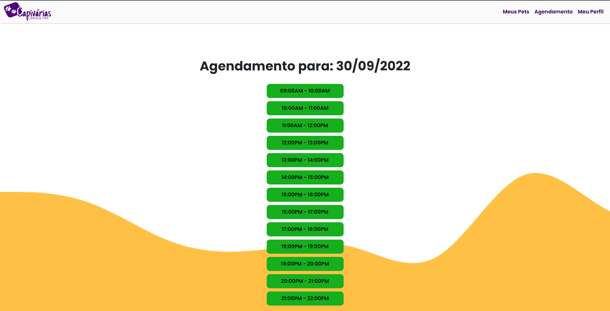 

# :book: Guia de Estilização
<a href="clinica_vet/img/Guia de Estilo.pdf"> Clique aqui para visualizar!</a>

# :computer: Tecnologias
.

# :older_man: Professores Envolvidos:
| [ Atila Olivi](https://github.com/profatila) |  [ Sergio Gal](https://github.com/professor-sergio) |  [ Wellington Souza](https://github.com/wltsouza) 
| :---: | :---: | :---: |

# :girl::boy: Desenvolvedores
| [ José Mota](https://github.com/eujosee) |  [ Liza França](https://github.com/LiihDev) |  [ Mateus Henrique](https://github.com/Mateus2611) |  [ Nathaly Ferreira](https://github.com/NathalyFerreiraF) |  [ Paulo Oliveira](https://github.com/Paulo-HSO) 
| :---: | :---: | :---: | :---: | :---: |

# :pray: Agradecimentos
Liza: Juntamente agradeço ao colega Leonardo Lopes (LeoLopesRibeiro) pela sua paciência e ajuda em todo o processo.

# :wrench: Licença
Capivárias utiliza a licença MIT. 
A documentação da Capivárias (por exemplo, arquivos .md na pasta ./docs) é licenciada pelo Creative Commons.

# :books: Referências:
Ícones: https://www.flaticon.com/br/autores/flat-icons  
Ilustrações: https://storyset.com/  
Vídeos: https://www.youtube.com/c/Phpstuff  
https://www.youtube.com/watch?v=buZ5m5TSL2E  
https://www.youtube.com/watch?v=am_wkEACtvA  
https://www.devmedia.com.br/php-sistema-de-login-com-niveis-de-acesso/37217#:~:text=Haver%C3%A1%20dois%20n%C3%ADveis%20de%20acesso,)%20e%20administrador%20(2)  
https://storyset.com/friends  
Tipografia: https://fonts.google.com/ 
Paleta de Cores: https://www.softr.io/tools/svg-wave-generator  
https://coolors.co/
